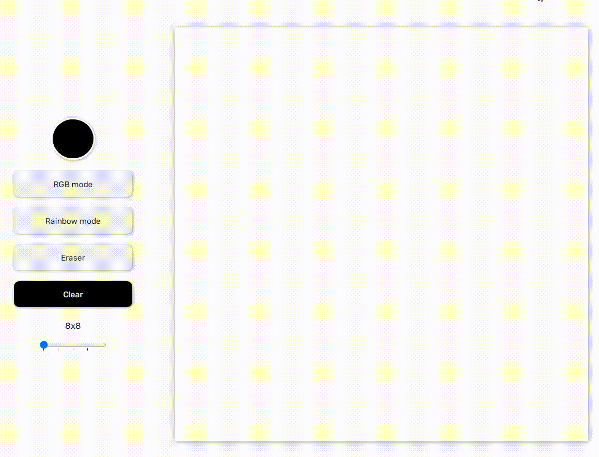

#   Paint 3.0

Welcome to Paint 3.0. This project is a tool that provides users with inspiration and ideas for their next painting project..

## Features

- Not responsive 
- A color picker tool
- A random color generator
- A grid layout (from 8x8 to 128x128)
- A clear all button
- An eraser tool

## Technologies Used

- HTML
- CSS
- JavaScript

## Getting Started

- To view the website, simply open the `index.html` file in your web browser.

- To modify the website, you can edit the HTML, CSS, and JavaScript files as needed.

- Please feel free to access my hosted game at [**Paint 3.0**](https://paint-3.netlify.app/) 🔗 to view my work and learn more about my skills and experience.

## Demo

## Contact

If you have any questions or comments, feel free to contact me at alibek.mukhammadiev@gmail.com

